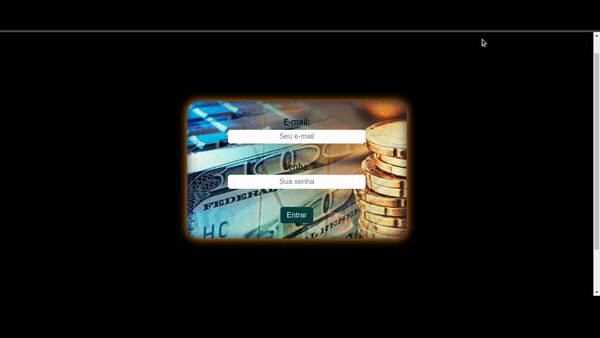
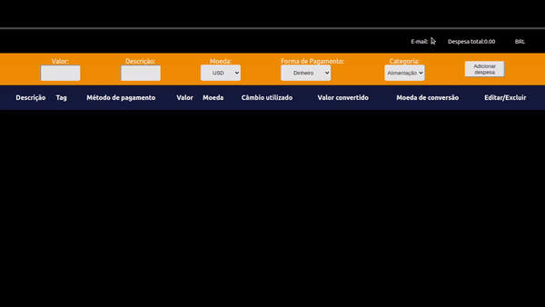
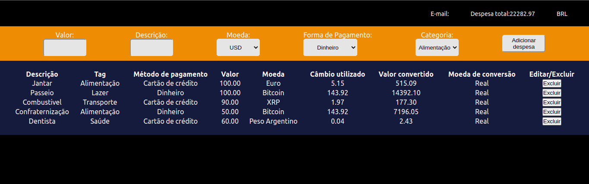
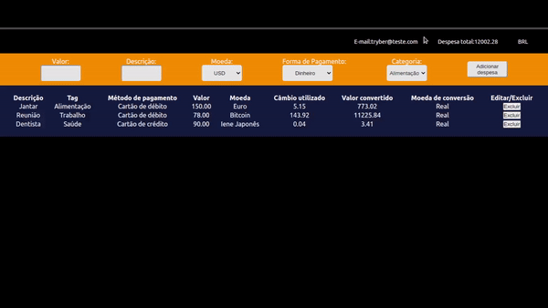
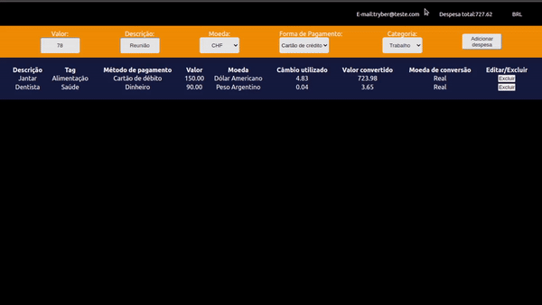

# 17 - Projeto Wallet

# Contexto
Este projeto trata-se de uma carteira de despesas, onde podemos organizar nossas despesas com gastos em diversas moedas e tendo o calculo total das despesas convertido em Real (R$) de acordo com seu valor de conversão atual, adquirido atraves da API: `https://economia.awesomeapi.com.br/`.

Esse projeto foi feito como validação do bloco de `introdução ao Redux` no modulo de `Front-End` da `Trybe`.

A aplicação consiste em uma pagina de `Login` e a pagina de `Despesas`:
<br>

## Login
A pagina `Login` consiste em dois campos de input sendo eles `E-mail` e `Senha`, e um button `Entrar`.



<br>

## Despesas

### Adicionando despesas
A `Tela de despesas` conta com 5 campos sendo eles:

`Valor da despesa` -> nesse campo colocamos o valor gasto com essa despesa.<br>
`Descrição da despesa` -> nesse campo colocamos onde tivemos esse gasto.<br>
`Moeda` -> nesse campo escolhemos qual moeda utilizamos para realizar o pagamento da despesa.<br>
`Método de pagamento` -> nesse campo escolhemos qual foi o método utilizado para realizar o pagamento.<br>
`Categoria` -> nesse campo escolhemos uma categoria que representa qual tipo de gasto tivemos.<br>



### Categorias da tabela
A `Tabela` conta com 9 categorias sendo elas:

`Descrição` -> aqui é mostrado qual foi a despesa.<br>
`Categoria` -> aqui temos a categoria da despesa.<br>
`Método de pagamento` -> aqui temos qual foi o método utilizado para pagar essa despesa.<br>
`Valor` -> aqui temos o valor gasto com a despesa.<br>
`Moeda` -> aqui temos o nome da moeda que foi utilizada para realizar o pagamento da despesa.<br>
`Câmbio utilizado` -> aqui temos qual o valor de conversão da moeda em relação ao Real (R$) no momento em que a despesa foi adicionada.<br>
`Valor convertido` -> aqui temos o valor da despesa em Real (R$).<br>
`Moeda de conversão` -> aqui temos a moeda base da conversão, no momento a aplicação tem apenas o Real (R$) como moeda base.<br>
`Editar/Excluir` -> aqui temos dois botões, o de `editar` despesa e o de `excluir` despesa.<br>



### Botões Excluir
Cada despesa conta com dois botões sendo eles:
 
`Excluir` -> ao clicar no botão `excluir` a despesa a qual o botão esta atribuído é removida da lista.<br>



### Header
O `Header` da pagina conta com uma `logo`, um `titulo`, o `E-mail do usuario`, o `valor total` e a `moeda base`.<br>



O valor total é a soma de todas as despesas com seu valor ja convertido para a moeda base (nesse caso o Real (R$)), sendo atualizado conforme adicionamos/excluímos despesas.<br>


## Técnologias usadas

Front-end:
> Desenvolvido usando: React, CSS3, JavaScript ES6, React Redux, React Router, API externa.

## Instalando Dependências

``` bash
npm install
``` 
## Executando aplicação

  ``` bash
  npm start
  ```
